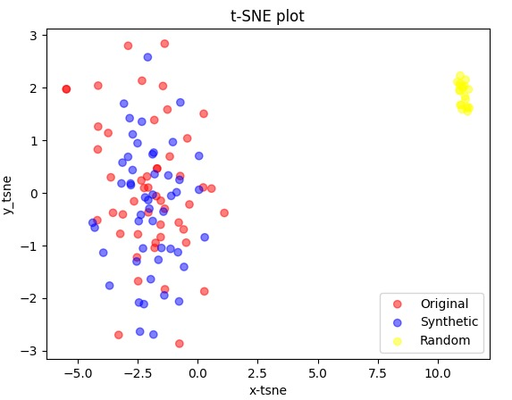

# Generative Adversarial Network pour la génération de données financières

|             |            |
| :---------: | :--------: |
|  |  |

Projet de Statistiques Appliquées, ENSAE 2023/2024

## Génération de données financières

Dans le cadre du développement, de l'estimation ou de l'utilisation de modèles, les données financières servent de support au modèle. On cherche ainsi à déduire des propriétés à partir d'un état du monde observé. On suppose donc que les réalisations d'une série observée sont les résultats d'un phénomène stochastique. Les méthodes statistiques usuelles supposent que les variations d'un actif financier (par exemple), suivent une certaine loi, dont on peut estimer les paramètres. A partir de ces estimations, on peut ensuite simuler et quantifier différentes réalisations de la série. Cette approche statistique nécessite de faire un certain nombre d'hypothèse sur la série observée, qui ne sont pas toujours vérifiée. Les méthodes de Machine Learning se caractérisent par des hypothèses moins fortes et une approche plus empiriste. 

## Les modèles GAN

Les modèles [GAN](https://arxiv.org/pdf/1406.2661.pdf) sont des modèles de génération de données. Ces derniers se sont inscrits dans le paysage de l'IA grâce à leurs performances, particulièrement sur la génération d'images (cf https://thispersondoesnotexist.com/ qui génère des visages). L'avantage de la génération d'images est qu'il est "facile" de vérifier les performances du modèles. Il est plus compliqué de voir si une donnée tabulaire ou une série financière est vraisemblable. L'enjeu du projet n'est donc pas seulement de mettre en place un modèle qui peut imiter une série numérique, mais aussi de pouvoir quantifier les résultats.

## Enjeux du projet 

Ainsi, le but de ce projet est, à partir des résultats existants de la littérature, de tester l’utilisation d’algorithme GAN afin d'apprendre sur des données de marchés et de génerer des scénarios futures possibles qui peuvent être utiles à exploiter selon le contexte. L'objectif principal est donc de tester différents types et catégories d'algorithmes GAN afin de tirer le potentiel exploitable pour notre problématique et aussi les limites. Une des finalités intéressantes serait également d'observer la plus-value de cette méthode par rapport aux méthodes stochastiques décrites plus haut.


## Start
Depuis un terminal, effectuer les commandes suivantes :

1. Assurez-vous d'avoir Python installé.
2. Clonez ce dépôt (cf: [Guide pour cloner un dépot](https://docs.github.com/fr/repositories/creating-and-managing-repositories/cloning-a-repository)).
3. Accédez au répertoire du projet via le terminal.

Après avoir créé un environnement virtuel (cf: [Guide création environnement virtuel sur vs code](https://code.visualstudio.com/docs/python/environments)) installer les packages nécessaires avec:

```bash
pip install -r requirements.txt
```

## Les notebooks

* ``presentation_gan``: présente une introduction générale au GAN en présentant un GAN de génération d'image développé avec PyTorch. 

* ``gan_cnn``: présente une première utilisation de modèle GAN pour la génération de données temporelles. Le modèle utilisé est un [W-GAN](https://arxiv.org/pdf/1701.07875.pdf) avec un réseau de neurone convolutif. Le générateur est conditionnel, c'est à dire qu'il fut entraîné à prendre en entrée le début d'une série pour en déduire les n valeurs suivantes. (Le notebook est encore "brouillon", simplement quelques résultats sont présentées. #TODO: Présentation du notebook)

* ``gan_lstm``: implémentation du modèle [Quant-Gan](https://arxiv.org/pdf/1907.06673.pdf).

* ``quant_gan``: Le modèle est pareil en tout point du modèle de ``gan_simulation``, mais l'architecture du modèle (générateur et discriminateur) est un [LSTM](https://deeplearning.cs.cmu.edu/F23/document/readings/LSTM.pdf) (Long Short Term Memory). 

* ``TimeGAN``: Implémentation du papier [TimeGan](https://proceedings.neurips.cc/paper_files/paper/2019/file/c9efe5f26cd17ba6216bbe2a7d26d490-Paper.pdf) avec TensorFlow /!\ Pour faire tourner le notebook, télécharger les packages de ``requirements2`` /!\

## Quelques résultats



